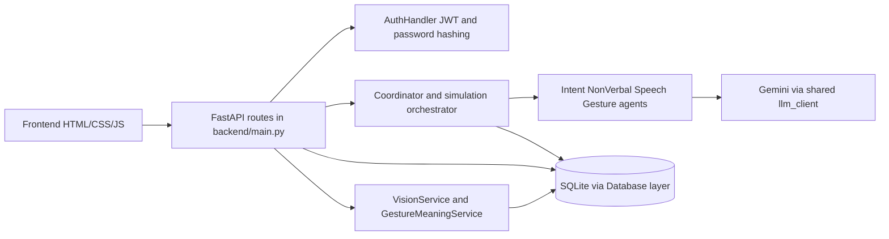
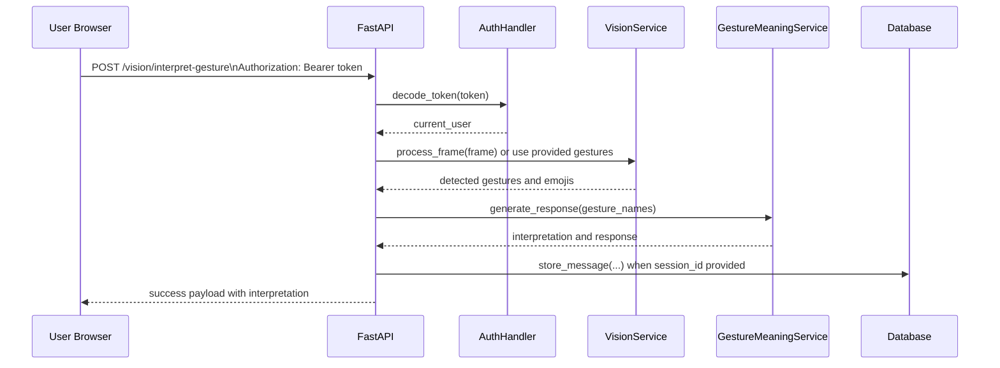
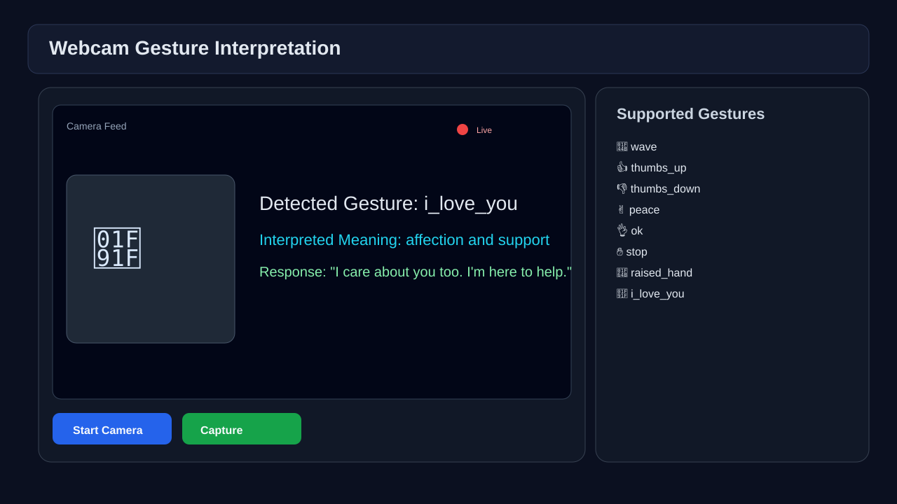
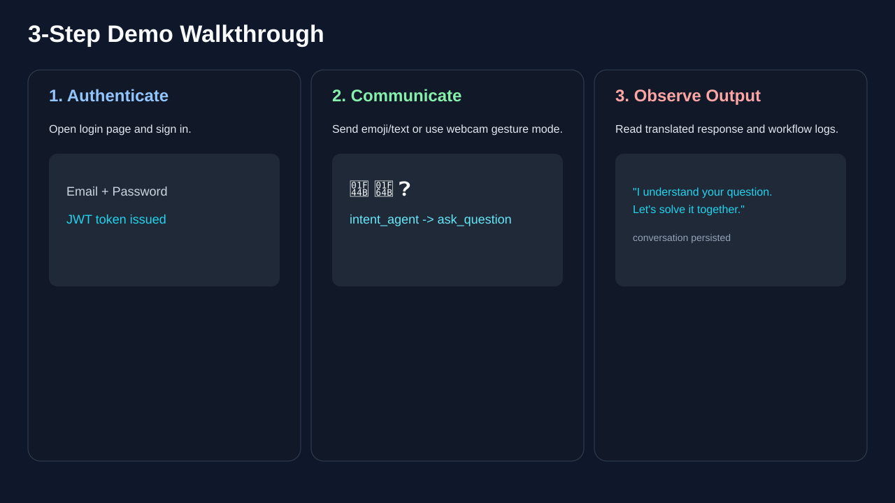

# Communication Bridge AI

[](https://www.python.org/)
[](https://fastapi.tiangolo.com/)
[](LICENSE)
[](#)

Communication Bridge AI is a FastAPI-based system that helps bridge communication between verbal and non-verbal users using text, gesture interpretation, and AI-assisted responses.

## Project Overview
This project supports communication in mixed ability contexts, including classroom and support scenarios, by combining:
- a browser-based interaction frontend,
- authenticated FastAPI APIs,
- a coordinator with specialized agents,
- gesture-to-meaning processing from vision input,
- persistence for sessions, messages, and logs.

Why it is technically interesting:
- Multi-agent workflow orchestration with fallback logic.
- End-to-end gesture pipeline from frame processing to contextual response.
- Session ownership enforcement and JWT-authenticated API boundaries.
- Production-oriented checks with lint, tests, security audit, and compile validation in CI.

## Core Features
- Bidirectional communication flows.
- Gesture detection and interpretation.
- Text-to-gesture translation.
- Context-aware AI responses with fallback logic.
- Authentication and credit-based usage controls.
- Session history and operational logs.

## Architecture



Detailed architecture notes: [docs/ARCHITECTURE.md](docs/ARCHITECTURE.md)

## Request Lifecycle Example
Representative flow for authenticated gesture interpretation using [backend/main.py](backend/main.py):



## Installation
### Prerequisites
- Python 3.11 (tested in CI)
- pip
- Optional: Gemini API key for AI-enhanced generation

### Python Compatibility Note
This repository is currently tested on Python 3.11 in CI. The dependency [mediapipe==0.10.8](requirements.txt) may not provide install wheels for all newer Python versions in all environments. Use Python 3.11 for the most reliable setup.

### Setup
```bash
git clone https://github.com/Hlomohangcue/Communication-Agent-AI.git
cd Communication-Agent-AI
python -m venv .venv
```

Windows PowerShell:
```powershell
.venv\Scripts\Activate.ps1
```

Linux or macOS:
```bash
source .venv/bin/activate
```

Install dependencies:
```bash
python -m pip install --upgrade pip
python -m pip install -r requirements.txt
python -m pip install -r requirements-dev.txt
```

Create local environment file:
```bash
cp .env.example .env
```

Windows PowerShell alternative:
```powershell
Copy-Item .env.example .env
```

## Configuration
Edit .env and set at minimum:
- GEMINI_API_KEY
- JWT_SECRET_KEY
- CORS_ORIGINS

Guidance:
- [docs/DEVELOPMENT.md](docs/DEVELOPMENT.md)
- [docs/SECURITY.md](docs/SECURITY.md)

## Running Locally
### Backend
```bash
cd backend
python main.py
```

### Frontend
Open [frontend/login.html](frontend/login.html) directly or serve static files:
```bash
python -m http.server 8080 --directory frontend
```

## Visual Showcase
The following are preview mockups (SVG assets), not production screenshots:

### Dashboard Preview Mockup


### Gesture Mode Preview Mockup


### Demo Walkthrough Storyboard Mockup


## Demo
No public hosted demo or video is currently linked in this repository.
Preview visuals are included above, and a live demo/video can be added in a future update.

## API

### Endpoint Access Table
| Method | Endpoint | Access |
|---|---|---|
| GET | / | Public |
| POST | /auth/signup | Public |
| POST | /auth/login | Public |
| GET | /auth/verify | Authenticated |
| GET | /auth/me | Authenticated |
| GET | /auth/credits | Authenticated |
| POST | /simulate/start | Authenticated |
| POST | /simulate/step | Authenticated |
| POST | /communicate | Authenticated |
| GET | /logs | Authenticated |
| GET | /session/{session_id} | Authenticated |
| DELETE | /session/{session_id} | Authenticated |
| GET | /sessions | Authenticated |
| POST | /save_message | Authenticated |
| POST | /translate/text-to-gesture | Authenticated |
| GET | /gestures | Public |
| GET | /phrases | Public |
| POST | /phrases/custom | Authenticated |
| GET | /gesture-history/{session_id} | Authenticated |
| POST | /vision/process-frame | Authenticated |
| GET | /vision/gestures | Public |
| POST | /vision/gesture-to-text | Authenticated |
| POST | /vision/interpret-gesture | Authenticated |

### API Example 1: Signup (Public)
Method and endpoint: POST /auth/signup

Request body:
```json
{
	"name": "Alex",
	"email": "alex@example.com",
	"password": "StrongPass123"
}
```

Example response:
```json
{
	"message": "User created successfully",
	"user": {
		"id": "7fcb2a67-8ac7-4a1a-bf88-0e16d4ec4be3",
		"email": "alex@example.com",
		"name": "Alex",
		"credits": 100
	}
}
```

### API Example 2: Start Simulation (Authenticated)
Method and endpoint: POST /simulate/start

Authentication: Bearer token required

Example response:
```json
{
	"session_id": "9e8f5ad4-c9ab-4d88-a3fb-47bb8b6a447f",
	"status": "started",
	"message": "Classroom simulation initialized",
	"user_credits": 99
}
```

### API Example 3: Interpret Gesture (Authenticated)
Method and endpoint: POST /vision/interpret-gesture

Authentication: Bearer token required

Request body (gesture payload mode):
```json
{
	"session_id": "9e8f5ad4-c9ab-4d88-a3fb-47bb8b6a447f",
	"gestures": [
		{"gesture": "thumbs_up", "confidence": 0.93}
	]
}
```

Example response:
```json
{
	"success": true,
	"vision_result": {
		"hands_detected": 1,
		"gestures": [{"gesture": "thumbs_up", "confidence": 0.93}],
		"emojis": ["👍"],
		"confidence": 0.8
	},
	"detected_gestures": [{"gesture": "thumbs_up", "confidence": 0.93}],
	"message": "Example interpretation message",
	"response": "Example generated response",
	"meanings": ["example meaning"]
}
```

Detailed endpoint reference: [docs/API.md](docs/API.md)

## Testing and Quality Checks
Use these commands from the repository root after activating your virtual environment:

```bash
python -m pytest
python -m ruff check backend tests
python -m compileall backend
python -m pip_audit -r requirements.txt
```

Note: if pip-audit is not installed, run python -m pip install pip-audit first.

Detailed testing guide: [docs/TESTING.md](docs/TESTING.md)

## Deployment
Deployment resources in this repository:
- [Dockerfile](Dockerfile): container image build for the backend service.
- [nginx.conf](nginx.conf): reverse proxy template for fronting the API.
- [deploy_vultr.sh](deploy_vultr.sh): server provisioning and deployment helper script.
- [docs/DEPLOYMENT.md](docs/DEPLOYMENT.md): deployment guide and production recommendations.

Production readiness depends on environment-specific validation (TLS, secrets, monitoring, and scaling) and should be verified per target platform.

## Documentation
Canonical references:
- API documentation: [docs/API.md](docs/API.md)
- Architecture: [docs/ARCHITECTURE.md](docs/ARCHITECTURE.md)
- Development guide: [docs/DEVELOPMENT.md](docs/DEVELOPMENT.md)
- Testing guide: [docs/TESTING.md](docs/TESTING.md)
- Deployment guide: [docs/DEPLOYMENT.md](docs/DEPLOYMENT.md)
- Security policy and design: [SECURITY.md](SECURITY.md) and [docs/SECURITY.md](docs/SECURITY.md)
- Repository audit: [REPOSITORY_AUDIT.md](REPOSITORY_AUDIT.md)
- Cleanup report: [CLEANUP_REPORT.md](CLEANUP_REPORT.md)
- Architecture decision records: [docs/adr](docs/adr)

## Roadmap
### Completed
- JWT authentication and protected endpoint boundaries.
- Session ownership checks for session-bound reads and writes.
- Shared LLM client integration with fallback behavior support.
- CI pipeline with lint, tests, dependency audit, and compile checks.

### In Progress
- Frontend modularization and UI structure cleanup.
- Documentation harmonization across root and docs directories.

### Planned
- Async-compatible database layer for scale.
- Additional LLM guardrails and policy checks.
- Expanded release automation and security coverage.

## Contributing
Contributions are welcome. Read [CONTRIBUTING.md](CONTRIBUTING.md) and [CODE_OF_CONDUCT.md](CODE_OF_CONDUCT.md) before opening issues or pull requests.

## License
MIT License. See [LICENSE](LICENSE).
